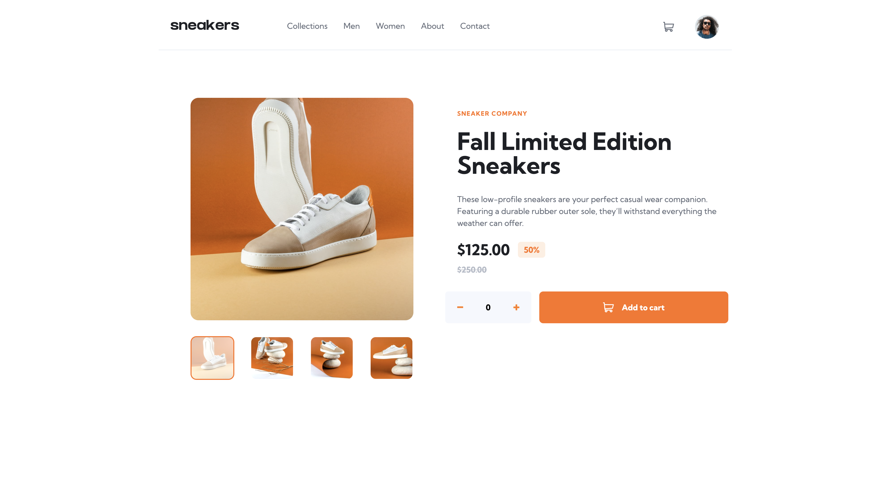
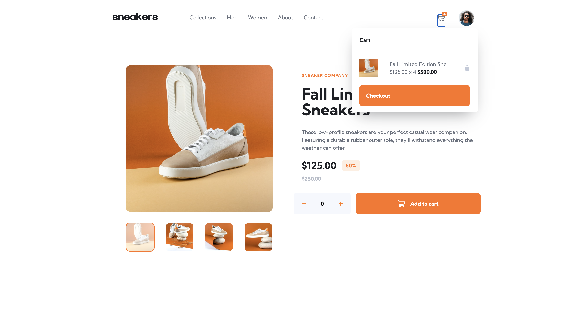
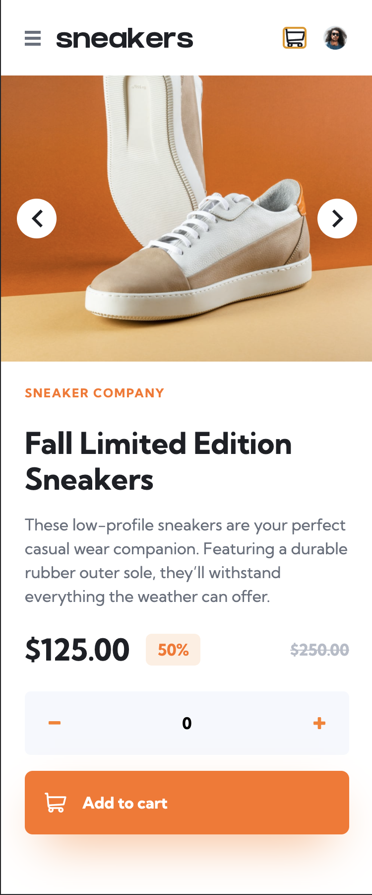
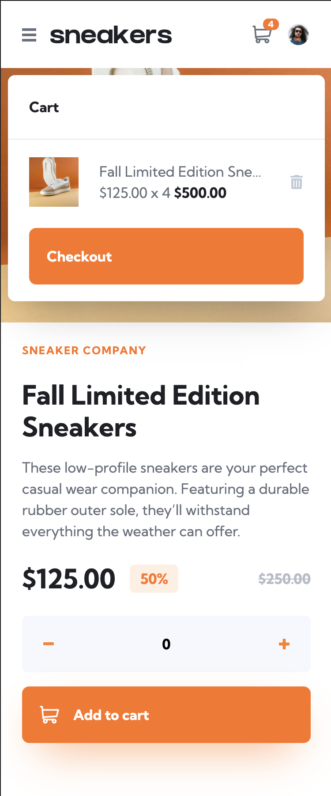

# Frontend Mentor - E-commerce product page solution

This is a solution to the [E-commerce product page challenge on Frontend Mentor](https://www.frontendmentor.io/challenges/ecommerce-product-page-UPsZ9MJp6). Frontend Mentor challenges help you improve your coding skills by building realistic projects.

## Table of contents

- [Overview](#overview)
  - [The challenge](#the-challenge)
  - [Screenshots](#screenshots)
  - [Links](#links)
- [My process](#my-process)
  - [Built with](#built-with)
  - [What I learned](#what-i-learned)
  - [Continued development](#continued-development)
  - [Useful resources](#useful-resources)
- [Author](#author)
- [Acknowledgments](#acknowledgments)

**Note: Delete this note and update the table of contents based on what sections you keep.**

## Overview

### The challenge

Users should be able to:

- View the optimal layout for the site depending on their device's screen size
- See hover states for all interactive elements on the page
- Open a lightbox gallery by clicking on the large product image
- Switch the large product image by clicking on the small thumbnail images
- Add items to the cart
- View the cart and remove items from it

### Screenshots

Desktop screenshot

](screenshots/desktop.png)

Desktop screenshot with cart open

](screenshots/desktop-with-cart.png)

Mobile screenshot

](screenshots/mobile.png)

Mobile screenshot with cart open

](screenshots/mobile-with-cart.png)

### Links

- Solution URL: [https://github.com/james-work-account/ecommerce-product-page](https://github.com/james-work-account/ecommerce-product-page)
- Live Site URL: [https://ecommerce-product-page.vercel.app/](https://ecommerce-product-page.vercel.app/)

## My process

### Built with

- Semantic HTML5 markup
- CSS custom properties
- [Tailwind CSS](https://tailwindcss.com/)
- Deployed with [Vercel](https://vercel.com/)

### What I learned

This was my first time using Tailwind for a full project, which was exciting. I still rely heavily on the docs but I've found my development speed vastly increase as I was building this project.

Starting mobile-first was key when building with Tailwind - it avoided me having to write a whole bunch of bodgey workarounds down the line. Tailwind's JIT compiler and purge options made re-compiling my code very fast (before I discovered this I was waiting a couple of seconds with every save before being able to see my progress in the browser 😳).

### Continued development

I've been documenting known bugs in my [Issues tab](https://github.com/james-work-account/ecommerce-product-page/issues) - if you find any others please feel free to raise a new Issue on there! Going forward I'd like to address these bugs and optimise my Tailwind class usage (I've still got a lot of reused code and as a React fanboy I like my reuseable components...).

### Useful resources

- [Tailwind docs](https://tailwindcss.com/docs) - The "Quick search for anything" feature basically saved me in this project.
- [nekoCalc's PX to REM converter](https://nekocalc.com/px-to-rem-converter) - for converting the Figma file's px values into rem units to use with Tailwind classes.

## Author

- [I'm in a band](https://lagunasdream.co.uk)
- Frontend Mentor - [@james-work-account](https://www.frontendmentor.io/profile/james-work-account)
